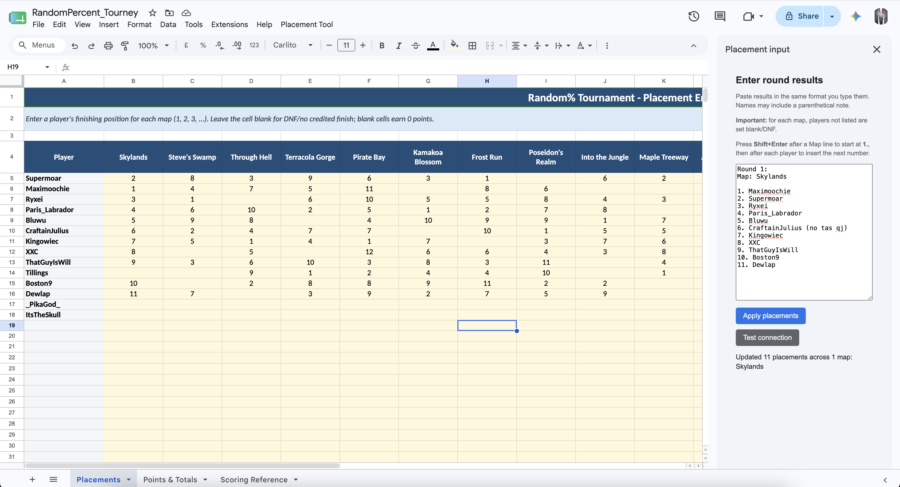

# DECL

DECL is an open-source suite of tools and archive for the **Dragon Escape Competitive League**.

The first included tool is a Google Sheets placement-entry helper for Random% tournaments. Paste a map's ranked finishers into a sidebar, and it writes each placement into the matching player row and map column automatically.



## Project scope

DECL is intended to grow into a shared home for:

- tournament administration and scoring tools;
- league data, formats, and historical records;
- reusable automation for organizers and competitors; and
- documentation that helps future Dragon Escape events build on prior work.

## Features

- Accepts natural ranked-list input with `Round`, `Map`, and numbered players.
- Matches map headers and player names case-insensitively.
- Ignores trailing parenthetical notes such as `(no tas qj)`.
- Supports any positive placement number, including 10th and later.
- Treats players omitted from a submitted map as blank/DNF for that map.
- Continues numbering automatically with **Shift+Enter**.
- Reports unknown maps, unknown players, and malformed lines before changing the sheet.
- Includes a spreadsheet-menu fallback for browsers where the sidebar bridge is unreliable.

## Example input

```text
Round 1:

Map: Skylands

1. Maximoochie
2. Supermoar
3. Ryxei
4. Paris_Labrador
5. Bluwu
6. CraftainJulius (no tas qj)
7. Kingowiec
8. XXC
9. ThatGuyIsWill
```

Player names must already exist in column A of the `Placements` sheet. The tool validates the entire submission before writing anything.

## Installation

1. Open `RandomPercent_Tourney_Example.xlsx` in Google Sheets and save it as a native Google Sheet.
2. Choose **Extensions → Apps Script**.
3. Replace the default script with [`placement-input-tool/Code.gs`](placement-input-tool/Code.gs).
4. Add an HTML file named `Index` and paste in [`placement-input-tool/Index.html`](placement-input-tool/Index.html).
5. Save the Apps Script project and reload the spreadsheet.
6. Choose **Placement Tool → Authorize / test connection** and approve access.
7. Choose **Placement Tool → Open placement input**.

Use **Shift+Enter** after a `Map:` line to insert `1.`, then use **Shift+Enter** after each player to insert the next number.

## Browser compatibility

Chrome is recommended.

Safari has been unreliable with Google Apps Script sidebars. In testing, Safari sometimes allowed menu-triggered functions but blocked the sidebar's `google.script.run` requests before they reached Apps Script. When that happens, no `placementToolPing` or `writePlacements` execution appears in the Apps Script execution log.

You can either:

- open the spreadsheet in Chrome; or
- use **Placement Tool → Open Safari-safe input sheet**, paste the result block into `A4`, then choose **Placement Tool → Apply from input sheet**.

## Workbook behavior

The included workbook contains:

- `Placements`: player names and map placements;
- `Points & Totals`: formula-driven points, totals, ranks, and rounds finished; and
- `Scoring Reference`: placement-to-points rules.

If you add players beyond the existing example rows, extend the formulas and formatting on `Points & Totals` to the corresponding rows.

## Files

- [`RandomPercent_Tourney_Example.xlsx`](RandomPercent_Tourney_Example.xlsx) — example tournament workbook.
- [`placement-input-tool/Code.gs`](placement-input-tool/Code.gs) — bound Apps Script logic.
- [`placement-input-tool/Index.html`](placement-input-tool/Index.html) — placement-entry sidebar.
- [`placement-input-tool/README.md`](placement-input-tool/README.md) — detailed tool instructions.
